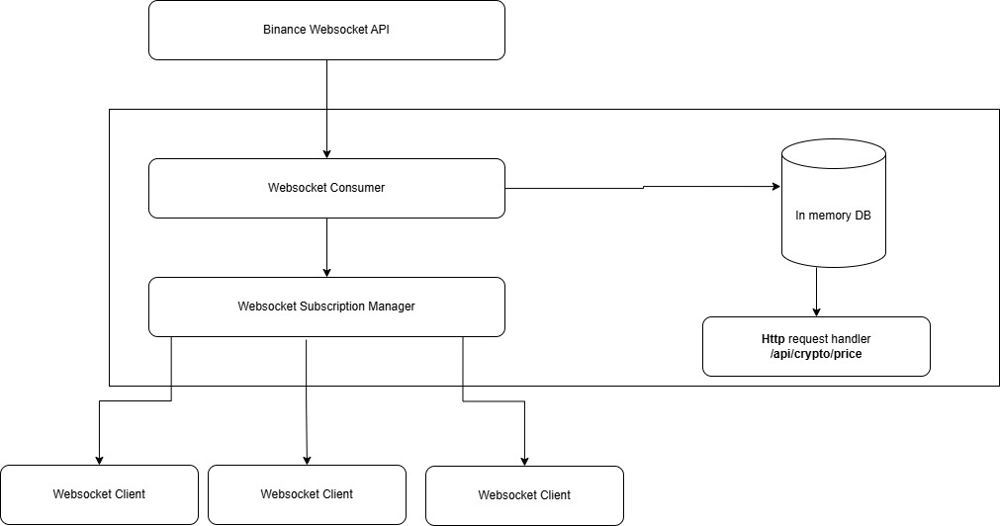

# Crypto Tracker
A web application that tracks cryptocurrency prices using the publicly available Binance Websocket Stream API.
The application is built using React and FastAPI.



`Figure 1: System Design`


# Backend for Crypto Tracker
The backend is written in Python using FastAPI.

## LOCAL DEVELOPMENT

### Installation
Create a virtual environment using venv
```
python -m venv .venv
```

Activate virtual environment
```
source venv/bin/activate
```

Install requirements
```aiignore
pip install -r requirements.txt
```

### Run development server
The server will be running on port 8000 at http://localhost:8000
```aiignore
python -m uvicorn --port 8000 --host 0.0.0.0 --reload main:app
```

## DOCKER DEVELOPMENT

### Build Docker Image
```aiignore
docker build -t crypto_tracker_backend -f Dockerfile.dev .  
```

### Run Docker Container
A new docker container will be created and run in the background on port 8000.

The environment variable STREAMS is used to specify the streams to subscribe to.
The environment variable ALLOWED_HOSTS is used to specify the allowed hosts.
The name of the image is crypto_tracker_backend.
The name of the container is backend.
App port 8000 is mapped to port 8000 on the host machine.

```aiignore
docker run -d -e STREAMS=ethusdt@ticker/solusdt@ticker/btcusdt@ticker -e ALLOWED_HOSTS=http://frontend:3000 -p 8000:8000 --name backend crypto_tracker_backend 
```

### Start Docker Container
This command will restart the docker container.

```aiignore
docker start backend
```

### Test Backend
Open the browser and navigate to http://localhost:8000/api/health. You should see the following response:

```json
{"status": "healthy", "message": "System is up and running, ready to receive requests."}
```


# Frontend for Crypto Tracker
The frontend is built using React.

## LOCAL DEVELOPMENT

### Installation
Install dependencies using `npm install`
```aiignore
npm install
```

### Running the app
Start the development server using `npm start`
The server will be run on port 3000 at http://127.0.0.1:3000.
```aiignore
npm start
```

## DOCKER DEVELOPMENT

### Build Docker Image
```aiignore
docker build -t crypto_tracker_frontend -f Dockerfile.dev .  
```

### Run Docker Container
A new docker container will be created and run in the background on port 8000.

The name of the image is crypto_tracker_frontend.
The name of the container is frontend.
App port 3000 is mapped to port 3000 on the host machine.

```aiignore
docker run -d -p 3000:3000 --name frontend crypto_tracker_frontend 
```

### Start Docker Container
This command will restart the docker container.

```aiignore
docker start frontend
```

### Test Docker Container
Open the browser and go to http://localhost:3000. You will see the main page of the app.
